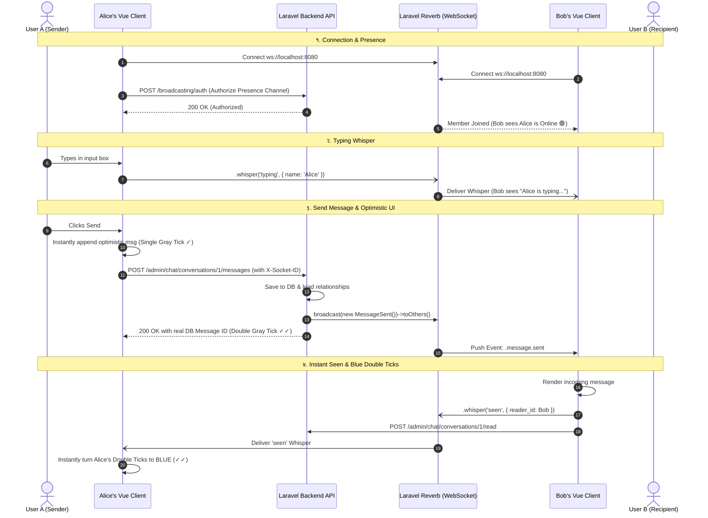

# 🎓 Laravel 13 & Reverb WebSocket Real-Time Multi-Tenant Chat Masterclass

> **नमस्ते विद्यार्थी साथी!** 👋  
> म तपाईंको शिक्षक (Instructor) हुँ। यस डकुमेन्टमा हामीले **Laravel 13**, **Laravel Reverb (Official WebSocket Server)**, **Laravel Echo**, र **Vue 3 (Inertia.js)** प्रयोग गरेर बनाएको Enterprise Multi-Tenant Real-Time Chat Module को **हरेक Migration, Model, Event, Controller, Channel Authorization, Web Route, र Frontend Vue Code** लाई लाइन-बाइ-लाइन नेपालीमा सिक्नेछौँ।

---

## 📑 विषयसूची (Table of Contents)
1. 🧠 [आधारभूत सिद्धान्त: HTTP vs WebSocket र Reverb के हो?](#1-आधारभूत-सिद्धान्त-http-vs-websocket-र-reverb-के-हो)
2. 🏢 [Multi-Tenant Data Isolation (कम्पनी A ले कम्पनी B को च्याट कहिल्यै नदेख्ने सुरक्षा)](#2-multi-tenant-data-isolation)
3. 🗄️ [Database Migrations (डेटाबेस संरचना र कोड)](#3-database-migrations)
4. 📦 [Eloquent Models & Relationships (सम्बन्ध र क्यास्टिङ)](#4-eloquent-models--relationships)
5. 📡 [WebSocket Broadcast Events (`ShouldBroadcastNow`)](#5-websocket-broadcast-events)
6. 🔒 [Channel Authorization (`routes/channels.php`)](#6-channel-authorization-routeschannelsphp)
7. 🚦 [Web Routes (`Modules/Chat/routes/web.php`)](#7-web-routes)
8. 🎮 [Chat Controller (`Modules/Chat/app/Http/Controllers/ChatController.php`)](#8-chat-controller)
9. 🔌 [Frontend Echo Setup (`resources/js/echo.ts`)](#9-frontend-echo-setup)
10. 💻 [Frontend Vue 3 WhatsApp Interface (`Index.vue`)](#10-frontend-vue-3-whatsapp-interface)
11. 🔄 [Full End-to-End WebSocket Lifecycle Flow](#11-full-end-to-end-websocket-lifecycle-flow)
12. 🎯 [Top Senior Developer WebSocket Interview Questions & Answers](#12-top-senior-developer-websocket-interview-questions--answers)

---

## 1. 🧠 आधारभूत सिद्धान्त: HTTP vs WebSocket र Reverb के हो?

### क) Traditional HTTP (Request-Response Cycle):
- **कसरी काम गर्छ:** Client (Browser) ले Server लाई Request पठाउँछ -> Server ले Response दिन्छ -> Connection बन्द हुन्छ (Stateless)।
- **समस्या:** यदि User B ले User A लाई म्यासेज पठायो भने, User A को ब्राउजरलाई तत्काल थाहा हुँदैन जबसम्म User A ले पेज Reload गर्दैन वा Polling (हरेक २ सेकेन्डमा सर्भरमा request) गर्दैन। यसले Server मा अत्यधिक Load पर्छ।

### ख) WebSockets (Full-Duplex, Persistent Connection):
- **कसरी काम गर्छ:** Client र Server बीच एक पटक **Handshake** भएपछि TCP Connection सधैँ खुला (Persistent) रहन्छ।
- **फाइदा:** जब User B ले म्यासेज पठाउँछ, Server ले तत्काल ० मिलिसेकेन्ड (Zero Latency) मा User A को खुला WebSocket Connection मा डेटा **Push** गरिदिन्छ।

### ग) Laravel Reverb के हो?
- पहिले Laravel मा WebSocket चलाउन Pusher (सशुल्क/Paid Cloud Service) वा Node.js (Socket.io/Laravel Echo Server) चाहिन्थ्यो।
- **Laravel Reverb** Laravel टिमले बनाएको आधिकारिक, Pure PHP, Asynchronous WebSocket Server हो। यो तपाईंकै सर्भरमा पोर्ट `8080` मा चल्छ र यसले कुनै बाहिरी शुल्क बिना लाखौँ Concurrent Connection धान्न सक्छ।

---

## 2. 🏢 Multi-Tenant Data Isolation

SaaS एप्लिकेशनमा सबैभन्दा ठूलो चुनौती **Company A का स्टाफले Company B का म्यासेज वा अनलाइन स्टाटस नदेखुन्** भन्ने हो।

हामीले यसलाई ३ तहमा सुरक्षित गरेका छौँ:
1. **Database Level:** प्रत्येक कुराकानी र म्यासेजमा `tenant_id` अनिवार्य छ।
2. **Controller Level:** `ResolvesCurrentTenantId` मार्फत हालको Tenant बाहेक अन्य Tenant को डेटा `404 / 403` हुन्छ।
3. **WebSocket Channel Level:** Channel को नाम नै `company.{companyId}.conversation.{conversationId}` बनाएर `routes/channels.php` मा युजर सोही कम्पनीको सदस्य हो कि होइन भनेर जाँचेर मात्र WebSocket मा प्रवेश दिइन्छ।

---

## 3. 🗄️ Database Migrations

हाम्रो च्याट मोड्युललाई ४ वटा मुख्य माइग्रेसन चाहिन्छ:

### १. Conversations Table (`create_conversations_table.php`)
यसले दुई जना बीचको Direct Chat वा धेरै जना बीचको Group Chat को रेकर्ड राख्छ।
```php
Schema::create('conversations', function (Blueprint $table): void {
    $table->id();
    $table->uuid('public_id')->unique(); // Frontend मा सेफ एक्सपोजरको लागि
    $table->foreignId('tenant_id')->constrained('tenants')->cascadeOnDelete(); // कम्पनी ID
    $table->string('type')->default('direct'); // direct वा group
    $table->string('title')->nullable(); // Group Chat भए नाम
    $table->foreignId('created_by')->constrained('users')->cascadeOnDelete();
    $table->timestamp('last_message_at')->nullable(); // सबभन्दा नयाँ म्यासेजको समय (सर्टिङको लागि)
    $table->timestamps();

    $table->index(['tenant_id', 'last_message_at']); // द्रुत खोजीको लागि इन्डेक्स
});
```

### २. Conversation Participants Table (`create_conversation_participants_table.php`)
कुन कुराकानीमा को-को युजर सामेल छन् र उनीहरूले कहिले अन्तिम पटक पढे (`last_read_at`) भन्ने रेकर्ड:
```php
Schema::create('conversation_participants', function (Blueprint $table): void {
    $table->id();
    $table->foreignId('conversation_id')->constrained('conversations')->cascadeOnDelete();
    $table->foreignId('user_id')->constrained('users')->cascadeOnDelete();
    $table->string('role')->default('member'); // admin वा member
    $table->timestamp('last_read_at')->nullable(); // अनरीड म्यासेज गन्न र ब्लु टिकको लागि
    $table->timestamps();

    $table->unique(['conversation_id', 'user_id']); // एउटै च्याटमा एउटै युजर दोहोरिन नदिन
});
```

### ३. Messages Table (`create_messages_table.php`)
वास्तविक म्यासेजहरू, फाइल, भ्वाइस नोटहरू सेभ गर्ने टेबल:
```php
Schema::create('messages', function (Blueprint $table): void {
    $table->id();
    $table->uuid('public_id')->unique();
    $table->foreignId('tenant_id')->constrained('tenants')->cascadeOnDelete();
    $table->foreignId('conversation_id')->constrained('conversations')->cascadeOnDelete();
    $table->foreignId('sender_id')->constrained('users')->cascadeOnDelete();
    $table->text('body');
    $table->string('type')->default('text'); // text, image, file, voice
    $table->json('attachments')->nullable(); // फाइल URL, नाम, साइज, Mime Type
    $table->boolean('is_read')->default(false); // ब्लु टिकको लागि
    $table->timestamps();

    $table->index(['tenant_id', 'conversation_id', 'created_at']);
});
```

### ४. WhatsApp Features Table (`add_whatsapp_features_to_messages_table.php`)
WhatsApp जस्तै Edit, Delete for everyone, Quoted Reply, र Emoji Reactions थप्ने माइग्रेसन:
```php
Schema::table('messages', function (Blueprint $table) {
    $table->foreignId('reply_to_id')->nullable()->after('conversation_id')->constrained('messages')->nullOnDelete(); // Quoted Reply
    $table->boolean('is_deleted')->default(false)->after('is_read'); // "This message was deleted"
    $table->timestamp('edited_at')->nullable()->after('is_deleted'); // "(edited)" ट्याग
    $table->json('reactions')->nullable()->after('edited_at'); // {"👍": [1, 2], "❤️": [3]}
});
```

---

## 4. 📦 Eloquent Models & Relationships

### `Message.php` (`Modules/Chat/app/Models/Message.php`)
```php
namespace Modules\Chat\Models;

use App\Models\User;
use Illuminate\Database\Eloquent\Model;
use Illuminate\Database\Eloquent\Relations\BelongsTo;
use Illuminate\Support\Str;
use Modules\Tenancy\Models\Tenant;

class Message extends Model
{
    protected $fillable = [
        'public_id', 'tenant_id', 'conversation_id', 'reply_to_id',
        'sender_id', 'body', 'type', 'attachments', 'is_read',
        'is_deleted', 'edited_at', 'reactions',
    ];

    // JSON र मितिलाई स्वतः PHP Array र Carbon Object मा रूपान्तरण गर्ने
    protected function casts(): array
    {
        return [
            'attachments' => 'array',
            'reactions' => 'array',
            'is_read' => 'boolean',
            'is_deleted' => 'boolean',
            'edited_at' => 'datetime',
        ];
    }

    protected static function booted(): void
    {
        static::creating(function (self $model): void {
            $model->public_id ??= (string) Str::uuid();
        });
    }

    public function conversation(): BelongsTo
    {
        return $this->belongsTo(Conversation::class, 'conversation_id');
    }

    public function sender(): BelongsTo
    {
        return $this->belongsTo(User::class, 'sender_id');
    }

    // Quoted Reply को सम्बन्ध
    public function replyTo(): BelongsTo
    {
        return $this->belongsTo(self::class, 'reply_to_id')->with('sender:id,name');
    }
}
```

---

## 5. 📡 WebSocket Broadcast Events

Laravel मा WebSocket मा इभेन्ट फाल्न Event Class बनाइन्छ। हामीले **`ShouldBroadcastNow`** प्रयोग गरेका छौँ ताकि Queue Worker को प्रतीक्षा नगरी **तत्काल ० सेकेन्ड** मा म्यासेज पुगोस्।

### १. `MessageSent.php` (नयाँ म्यासेज प्रसारण)
```php
namespace Modules\Chat\Events;

use Illuminate\Broadcasting\PrivateChannel;
use Illuminate\Contracts\Broadcasting\ShouldBroadcastNow;
use Modules\Chat\Models\Message;

class MessageSent implements ShouldBroadcastNow
{
    public function __construct(public Message $message)
    {
        // Eager load गरेर payload तयार पार्ने
        $this->message->loadMissing(['sender:id,name,avatar_path', 'replyTo.sender:id,name']);
    }

    // कुन च्यानेलमा म्यासेज पठाउने? (कम्पनी र कुराकानी अनुसारको Private Channel)
    public function broadcastOn(): array
    {
        return [
            new PrivateChannel("company.{$this->message->tenant_id}.conversation.{$this->message->conversation_id}"),
        ];
    }

    // Frontend Echo ले सुन्ने Event को नाम
    public function broadcastAs(): string
    {
        return 'message.sent';
    }

    // WebSocket मा पठाइने सफा Payload
    public function broadcastWith(): array
    {
        return [
            'id' => $this->message->id,
            'conversation_id' => $this->message->conversation_id,
            'body' => $this->message->body,
            'type' => $this->message->type,
            'attachments' => $this->message->attachments,
            'is_read' => false,
            'is_deleted' => false,
            'edited_at' => null,
            'reactions' => [],
            'reply_to' => $this->message->replyTo ? [
                'id' => $this->message->replyTo->id,
                'body' => $this->message->replyTo->is_deleted ? 'This message was deleted' : $this->message->replyTo->body,
                'sender_name' => $this->message->replyTo->sender?->name ?? 'User',
            ] : null,
            'created_at' => $this->message->created_at?->toISOString(),
            'sender' => [
                'id' => $this->message->sender?->id,
                'name' => $this->message->sender?->name,
                'avatar_url' => $this->message->sender?->avatar_url,
            ],
        ];
    }
}
```

### २. `MessagesRead.php` (Blue Tick / Seen प्रसारण)
```php
class MessagesRead implements ShouldBroadcastNow
{
    public function __construct(
        public int $tenantId,
        public int $conversationId,
        public int $readerId
    ) {}

    public function broadcastOn(): array
    {
        return [
            new PrivateChannel("company.{$this->tenantId}.conversation.{$this->conversationId}"),
        ];
    }

    public function broadcastAs(): string
    {
        return 'messages.read';
    }

    public function broadcastWith(): array
    {
        return [
            'tenant_id' => $this->tenantId,
            'conversation_id' => $this->conversationId,
            'reader_id' => $this->readerId,
        ];
    }
}
```

---

## 6. 🔒 Channel Authorization (`routes/channels.php`)

जब ब्राउजरले कुनै Private वा Presence Channel मा जोडिन्छ, Laravel ले यो फाइलको Callback रन गर्छ:

```php
use App\Models\User;
use Illuminate\Support\Facades\Broadcast;
use Modules\Chat\Models\Conversation;

// १. कुराकानीको Private Channel Authorization
Broadcast::channel('company.{companyId}.conversation.{conversationId}', function (User $user, int|string $companyId, int|string $conversationId) {
    $companyId = (int) $companyId;
    $conversationId = (int) $conversationId;

    $isSuperAdmin = $user->hasRole('SuperAdmin') || (int) $user->id === 1;

    // नियम १: युजर सोही कम्पनीको सदस्य हुनुपर्छ
    if (! $isSuperAdmin && ! $user->tenants()->where('tenants.id', $companyId)->exists()) {
        return false; // ४०३ Forbidden
    }

    // नियम २: कुराकानी सोही कम्पनीको हुनुपर्छ र प्रयोगकर्ता सामेल भएको हुनुपर्छ
    if ($isSuperAdmin) {
        return Conversation::where('id', $conversationId)->where('tenant_id', $companyId)->exists();
    }

    return Conversation::where('id', $conversationId)
        ->where('tenant_id', $companyId)
        ->whereHas('participants', fn ($q) => $q->where('user_id', $user->id))
        ->exists();
});

// २. कम्पनी स्टाफको Presence Channel (Online उपस्थिति देखाउन)
Broadcast::channel('company.{companyId}.presence', function (User $user, int|string $companyId) {
    $companyId = (int) $companyId;
    $isSuperAdmin = $user->hasRole('SuperAdmin') || (int) $user->id === 1;

    if (! $isSuperAdmin && ! $user->tenants()->where('tenants.id', $companyId)->exists()) {
        return false;
    }

    // Presence Channel मा Boolean को सट्टा युजरको Array Data फर्काइन्छ
    return [
        'id' => $user->id,
        'name' => $user->name,
        'email' => $user->email,
        'avatar_url' => $user->avatar_url,
    ];
});
```

---

## 7. 🚦 Web Routes (`Modules/Chat/routes/web.php`)

```php
Route::middleware(['auth', 'tenant'])->prefix('admin/chat')->name('admin.chat.')->group(function () {
    Route::get('/', [ChatController::class, 'index'])->name('index'); // मुख्य च्याट UI
    Route::post('/direct', [ChatController::class, 'startDirect'])->name('direct'); // १-on-१ च्याट सुरु
    Route::post('/group', [ChatController::class, 'startGroup'])->name('group'); // Group च्याट बनाउने
    Route::get('/conversations/{id}/messages', [ChatController::class, 'getMessages'])->name('messages.index');
    Route::post('/conversations/{id}/messages', [ChatController::class, 'sendMessage'])->name('messages.store');
    Route::put('/conversations/{conversationId}/messages/{messageId}', [ChatController::class, 'editMessage'])->name('messages.update'); // Edit
    Route::delete('/conversations/{conversationId}/messages/{messageId}', [ChatController::class, 'deleteMessage'])->name('messages.destroy'); // Delete
    Route::post('/conversations/{conversationId}/messages/{messageId}/react', [ChatController::class, 'reactMessage'])->name('messages.react'); // Reaction
    Route::post('/conversations/{id}/read', [ChatController::class, 'markAsRead'])->name('messages.read'); // Seen / Read
});
```

---

## 8. 🎮 Chat Controller (`ChatController.php`)

### म्यासेज पठाउने विधि (`sendMessage`):
```php
public function sendMessage(Request $request, int $id): JsonResponse
{
    $tenantId = $this->getTenantId($request);
    $user = $request->user();

    $validated = $request->validate([
        'body' => ['nullable', 'string', 'max:5000'],
        'type' => ['nullable', 'string', 'in:text,image,file,voice'],
        'reply_to_id' => ['nullable', 'integer'],
        'file' => ['nullable', 'file', 'max:25600'],
    ]);

    $conversation = Conversation::where('tenant_id', $tenantId)
        ->where('id', $id)
        ->whereHas('participants', fn ($q) => $q->where('user_id', $user->id))
        ->firstOrFail();

    // फाइल वा अडियो भ्वाइस नोट अपलोड ह्यान्डलिंग
    $attachments = null;
    $type = $validated['type'] ?? 'text';
    if ($request->hasFile('file')) {
        $path = $request->file('file')->store("chat_uploads/{$tenantId}/{$conversation->id}", 'public');
        $attachments = [[
            'url' => Storage::url($path),
            'name' => $request->file('file')->getClientOriginalName(),
            'size' => $request->file('file')->getSize(),
        ]];
    }

    $message = Message::create([
        'tenant_id' => $tenantId,
        'conversation_id' => $conversation->id,
        'reply_to_id' => $validated['reply_to_id'] ?? null,
        'sender_id' => $user->id,
        'body' => $validated['body'] ?? 'Attachment',
        'type' => $type,
        'attachments' => $attachments,
    ]);

    $conversation->update(['last_message_at' => now()]);
    $message->load(['sender:id,name,avatar_path', 'replyTo.sender:id,name']);

    // महत्वपूर्ण: toOthers() ले पठाउने युजरलाई छाडेर अरूलाई मात्र WebSocket मा फाल्छ
    broadcast(new MessageSent($message))->toOthers();

    return response()->json(['success' => true, 'message' => $message]);
}
```

---

## 9. 🔌 Frontend Echo Setup (`resources/js/echo.ts`)

```typescript
import Echo from 'laravel-echo';
import Pusher from 'pusher-js';

window.Pusher = Pusher;

export const echo = new Echo({
    broadcaster: 'reverb',
    key: import.meta.env.VITE_REVERB_APP_KEY,
    wsHost: import.meta.env.VITE_REVERB_HOST ?? window.location.hostname,
    wsPort: Number(import.meta.env.VITE_REVERB_PORT ?? 8080),
    wssPort: Number(import.meta.env.VITE_REVERB_PORT ?? 8080),
    forceTLS: (import.meta.env.VITE_REVERB_SCHEME ?? 'http') === 'https',
    enabledTransports: ['ws', 'wss'],
    authEndpoint: '/broadcasting/auth',
    auth: {
        headers: {
            'X-Requested-With': 'XMLHttpRequest',
            'X-CSRF-TOKEN': (document.querySelector('meta[name="csrf-token"]') as HTMLMetaElement)?.content || '',
        },
    },
});

window.Echo = echo;
export default echo;
```

---

## 10. 💻 Frontend Vue 3 WhatsApp Interface (`Index.vue`)

### WebSocket Listener हरूको संरचना:
```typescript
const subscribeToConversationChannel = (convId: number) => {
    const channelName = `company.${props.companyId}.conversation.${convId}`;

    window.Echo.private(channelName)
        // १. नयाँ म्यासेज आउँदा
        .listen('.message.sent', (event: any) => {
            if (event.conversation_id === activeConvId.value) {
                messages.value.push(event);
                scrollToBottom();
            }
        })
        // २. म्यासेज एडिट हुँदा
        .listen('.message.updated', (event: any) => {
            const idx = messages.value.findIndex((m) => m.id === event.id);
            if (idx !== -1) messages.value[idx] = event;
        })
        // ३. म्यासेज डिलिट हुँदा
        .listen('.message.deleted', (event: any) => {
            const idx = messages.value.findIndex((m) => m.id === event.id);
            if (idx !== -1) {
                messages.value[idx].is_deleted = true;
                messages.value[idx].body = '🚫 This message was deleted';
            }
        })
        // ४. इमोजी रियाक्सन आउँदा
        .listen('.message.reacted', (event: any) => {
            const msg = messages.value.find((m) => m.id === event.id);
            if (msg) msg.reactions = event.reactions;
        })
        // ५. म्यासेज पढियो (Blue Ticks)
        .listen('.messages.read', () => {
            messages.value.forEach((m) => {
                if (m.sender.id === props.currentUser.id) m.is_read = true;
            });
        })
        // ६. तत्काल Blue Tick को लागि Whisper
        .listenForWhisper('seen', () => {
            messages.value.forEach((m) => {
                if (m.sender.id === props.currentUser.id) m.is_read = true;
            });
        })
        // ७. "typing..." whisper
        .listenForWhisper('typing', (event: { name: string }) => {
            typingUser.value = event.name;
            clearTimeout(typingTimeout);
            typingTimeout = setTimeout(() => { typingUser.value = null; }, 2500);
        });
};
```

---

## 11. 🔄 Full End-to-End WebSocket Lifecycle Flow



---

## 12. 🎯 Top Senior Developer WebSocket Interview Questions & Answers

### प्रश्न १: Laravel Reverb र Pusher बीच मुख्य भिन्नता के हो?
**उत्तर:**  
Pusher एउटा तेस्रो पक्ष (Third-party) क्लाउड सेवा हो जसमा प्रति दिन म्यासेज संख्या र Concurrent Connection को सीमितता (र महँगो शुल्क) हुन्छ।  
**Laravel Reverb** पहिलो पार्टी (First-Party) सफ्टवेयर हो जुन आफ्नै सर्भरमा निशुल्क चल्छ। यो PHP को Asynchronous Event Loop मा आधारित छ र यसले हजारौँ WebSockets Connection धान्न सक्छ।

### प्रश्न २: `ShouldBroadcast` र `ShouldBroadcastNow` बीच के फरक छ?
**उत्तर:**  
- `ShouldBroadcast`: यो इभेन्ट Laravel को Queue Worker (जस्तै Redis वा Database) मा जान्छ। Queue मा धेरै काम अड्किएमा च्याट म्यासेज केही सेकेन्ड ढिला हुन सक्छ।
- `ShouldBroadcastNow`: यो इभेन्ट Queue मा नगई सिधै तत्काल (० मिलिसेकेन्ड) WebSocket सर्भरमा प्रसारण हुन्छ। च्याट, भ्वाइस कल, र गेमिङका लागि `ShouldBroadcastNow` अनिवार्य हुन्छ।

### प्रश्न ३: `broadcast()->toOthers()` किन प्रयोग गरिन्छ र `X-Socket-ID` को के भूमिका हुन्छ?
**उत्तर:**  
च्याट एप्लिकेशनमा युजरले सेन्ड थिच्ने बित्तिकै Frontend ले Optimistic UI बाट म्यासेज देखाइसकेको हुन्छ। यदि सर्भरले सोही म्यासेज पुनः WebSocket बाट सेन्डरलाई पठायो भने स्क्रिनमा Duplicate म्यासेज देखिन्छ।  
Frontend ले request पठाउँदा `X-Socket-ID` हेडर पठाउँछ र Laravel ले `toOthers()` मार्फत Reverb लाई यो Socket ID बाहेक अरू सबैलाई मात्र म्यासेज पठाउन निर्देशन दिन्छ।

### प्रश्न ४: Client Whispering के हो र यो कहिले प्रयोग गर्ने?
**उत्तर:**  
Client Whispering यस्तो सुविधा हो जसमा डेटाबेस वा Laravel Backend Controller लाई कुनै असर नपारी एउटा ब्राउजरले अर्को ब्राउजरलाई WebSocket सर्भर मार्फत सिधै सानो डेटा पठाउन सक्छ।  
यसलाई डेटाबेसमा सेभ गर्न नपर्ने क्षणिक डेटा जस्तै `"User is typing..."` र `"Message Seen"` को लागि प्रयोग गरिन्छ।

---

**बधाई छ! अब तपाईं Laravel 13 र Reverb WebSocket को रियल-टाइम इन्टरप्राइज आर्किटेक्चरमा पूर्ण निपुण हुनुभयो। 🎉**
