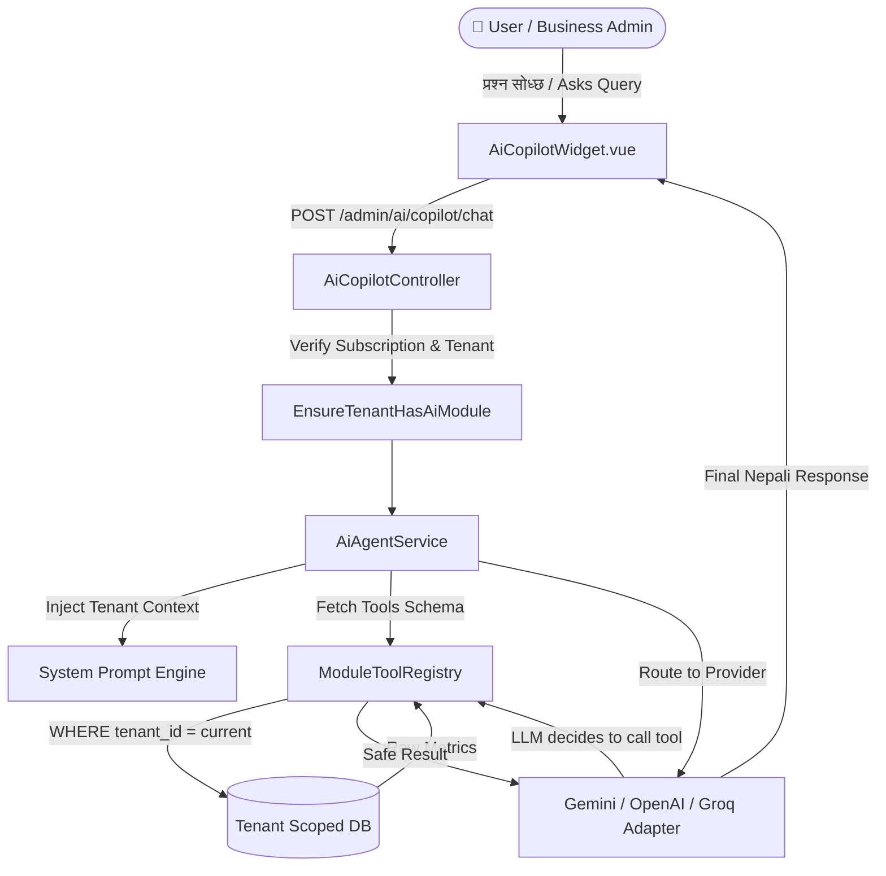

# 🤖 SaaS AI Copilot & Agent Module Architecture, Extensibility & Security Guide
> **Multi-Tenant Autonomous ERP AI Assistant Documentation**  
> *Language: Nepali & English Technical Terminology*

---

## 📑 विषय-सूची (Table of Contents)
1. [AI मोड्युलको समग्र संरचना (Architecture Overview)](#1-ai-मोड्युलको-समग्र-संरचना)
2. [मुख्य फाइलहरू र तिनको भूमिका (File Structure & Roles)](#2-मुख्य-फाइलहरू-र-तिनको-भूमिका)
3. [नयाँ मोड्युल र Tools थप्ने तरिका (Adding New AI Tools & Modules)](#3-नयाँ-मोड्युल-र-tools-थप्ने-तरिका)
4. [नयाँ AI Providers र Models थप्ने तरिका (Adding New Providers & Models)](#4-नयाँ-ai-providers-र-models-थप्ने-तरिका)
5. [डाटा सुरक्षा र Data Leak रोक्ने नियमहरू (Security & Tenant Isolation)](#5-डाटा-सुरक्षा-र-data-leak-रोक्ने-नियमहरू)
6. [DELETE/UPDATE जस्ता हानिकारक क्वेरी रोक्ने रणनीति (Preventing Mutations)](#6-deleteupdate-जस्ता-हानिकारक-क्वेरी-रोक्ने-रणनीति)
7. [System Prompt र Context Engineering (Prompt Optimization)](#7-system-prompt-र-context-engineering)

---

## 1. AI मोड्युलको समग्र संरचना (Architecture Overview)

हाम्रो SaaS प्लेटफर्ममा AI Copilot लाई **Modular Clean Architecture** र **Function Calling (Tool Execution) Pattern** मा विकास गरिएको छ।



---

## 2. मुख्य फाइलहरू र तिनको भूमिका (File Structure & Roles)

सबै AI कोडहरू `Modules/AI/` भित्र सुरक्षित र व्यवस्थित छन्:

| क्र.सं. | फाइलको ठेगाना (File Path) | भूमिका र कार्य (Role & Responsibility) |
| :--- | :--- | :--- |
| 1 | [AiServiceProvider.php](file:///Users/rnkhatri/Sites/rnsaas/Modules/AI/app/Providers/AiServiceProvider.php) | मोड्युललाई Laravel मा दर्ता गर्ने, Config लोड गर्ने। |
| 2 | [config/ai.php](file:///Users/rnkhatri/Sites/rnsaas/Modules/AI/config/ai.php) | सबै AI Providers (Gemini, Groq, OpenAI, Ollama) र तिनीहरूका Models को लिस्ट। |
| 3 | [EnsureTenantHasAiModule.php](file:///Users/rnkhatri/Sites/rnsaas/Modules/AI/app/Http/Middleware/EnsureTenantHasAiModule.php) | Tenant को सब्स्क्रिप्सन प्लानमा `ai` फिचर सक्रिय छ कि छैन जाँच्ने गेटकीपर। |
| 4 | [AiCopilotController.php](file:///Users/rnkhatri/Sites/rnsaas/Modules/AI/app/Http/Controllers/AiCopilotController.php) | चैट रिक्वेस्ट (`/chat`) र स्थिति (`/status`) ह्यान्डल गर्ने कन्ट्रोलर। |
| 5 | [AiAgentService.php](file:///Users/rnkhatri/Sites/rnsaas/Modules/AI/app/Services/AiAgentService.php) | System Prompt इन्जेक्ट गर्ने, Key डिक्रिप्ट गर्ने, र उपयुक्त Adapter छान्ने Orchestrator। |
| 6 | [ModuleToolRegistry.php](file:///Users/rnkhatri/Sites/rnsaas/Modules/AI/app/Services/ModuleToolRegistry.php) | **(सबैभन्दा महत्त्वपूर्ण)** AI ले चलाउन पाउने Tools को Schema र Database Query लेयर। |
| 7 | [GeminiProviderAdapter.php](file:///Users/rnkhatri/Sites/rnsaas/Modules/AI/app/Services/Adapters/GeminiProviderAdapter.php) | Google Gemini 3.6 / Flash सँग Function Calling र Multi-part च्याट गर्ने एडाप्टर। |
| 8 | [OpenAiCompatibleProviderAdapter.php](file:///Users/rnkhatri/Sites/rnsaas/Modules/AI/app/Services/Adapters/OpenAiCompatibleProviderAdapter.php) | OpenAI, Groq Cloud, DeepSeek सँग च्याट गर्ने एडाप्टर। |
| 9 | [AiCopilotWidget.vue](file:///Users/rnkhatri/Sites/rnsaas/resources/js/components/AiCopilotWidget.vue) | अगाडिको सुन्दर Floating Chat Widget (Voice, Markdown, Quick Prompts सहित)। |
| 10 | [OrganizationSidebar.vue](file:///Users/rnkhatri/Sites/rnsaas/resources/js/components/OrganizationSidebar.vue) | साइडबारमा AI Copilot बटन जसले विजेट खोल्छ। |

---

## 3. नयाँ मोड्युल र Tools थप्ने तरिका (Adding New AI Tools & Modules)

भविष्यमा जब नयाँ मोड्युल (जस्तै **HRM / Staff / Leave Balance**, **Customer CRM**, वा **Tax/VAT**) थप्नुपर्छ, केवल **२ वटा स्टेप** मा `ModuleToolRegistry.php` मा कोड थप्नुपर्छ:

### चरण १: `getToolDeclarations()` मा टूलको Schema घोषणा गर्ने
फाइल खोल्नुहोस्: [ModuleToolRegistry.php](file:///Users/rnkhatri/Sites/rnsaas/Modules/AI/app/Services/ModuleToolRegistry.php)
```php
public function getToolDeclarations(): array
{
    return [
        // ... पुरानो टूल्स ...

        // 🌟 उदाहरण: नयाँ HRM Leave & Attendance Tool थप्दा:
        [
            'name' => 'get_hrm_attendance_and_leaves',
            'description' => 'Get employee attendance summary, absent staff count, and pending leave requests for the current company.',
            'parameters' => [
                'type' => 'object',
                'properties' => [
                    'date' => [
                        'type' => 'string',
                        'description' => 'Date in YYYY-MM-DD format (leave empty for today).',
                    ],
                ],
            ],
        ],
    ];
}
```

### चरण २: `execute()` र Private Query Method लेख्ने
त्यसै फाइलमा Query लेख्नुहोस् (जहिले पनि `tenant_id` सुरक्षित राख्नुहोस्):
```php
public function execute(string $toolName, array $parameters, Tenant $tenant): array
{
    return match ($toolName) {
        'get_sales_overview' => $this->getSalesOverview($tenant, $parameters),
        'get_financial_summary' => $this->getFinancialSummary($tenant, $parameters),
        
        // 🌟 नयाँ टूल यहाँ जोड्नुहोस्:
        'get_hrm_attendance_and_leaves' => $this->getHrmAttendanceSummary($tenant, $parameters),
        
        default => ['error' => "Unknown tool '{$toolName}'"],
    };
}

private function getHrmAttendanceSummary(Tenant $tenant, array $params): array
{
    $date = $params['date'] ?? now()->toDateString();

    // 🔒 कडा सुरक्षा: सधैं where('tenant_id', $tenant->id) प्रयोग गर्नुहोस्
    $totalStaff = \Modules\HRM\Models\Employee::where('tenant_id', $tenant->id)->where('status', 'active')->count();
    $presentToday = \Modules\HRM\Models\Attendance::where('tenant_id', $tenant->id)->whereDate('date', $date)->count();
    $pendingLeaves = \Modules\HRM\Models\LeaveRequest::where('tenant_id', $tenant->id)->where('status', 'pending')->count();

    return [
        'date' => $date,
        'total_active_staff' => $totalStaff,
        'present_staff_count' => $presentToday,
        'absent_staff_count' => max(0, $totalStaff - $presentToday),
        'pending_leave_requests' => $pendingLeaves,
    ];
}
```

---

## 4. नयाँ AI Providers र Models थप्ने तरिका (Adding New Providers & Models)

यदि भोलि गएर **Claude (Anthropic)**, **DeepSeek**, वा **Ollama Local LLM** थप्न परेमा:

### चरण १: Config मा Provider थप्नुहोस्
[config/ai.php](file:///Users/rnkhatri/Sites/rnsaas/Modules/AI/config/ai.php)
```php
'providers' => [
    'deepseek' => [
        'name' => 'DeepSeek AI',
        'api_base_url' => 'https://api.deepseek.com/chat/completions',
        'default_model' => 'deepseek-chat',
        'available_models' => [
            'deepseek-chat' => 'DeepSeek V3 (Affordable & Powerful)',
            'deepseek-reasoner' => 'DeepSeek R1 (Advanced Reasoning)',
        ],
        'timeout' => 45,
    ],
]
```

### चरण २: Adapter दर्ता गर्नुहोस्
[AiAgentService.php](file:///Users/rnkhatri/Sites/rnsaas/Modules/AI/app/Services/AiAgentService.php) को `getAdapter()` विधिमा:
```php
public function getAdapter(string $provider): AiProviderInterface
{
    return match ($provider) {
        'gemini' => new GeminiProviderAdapter,
        'deepseek' => new OpenAiCompatibleProviderAdapter(
            defaultBaseUrl: 'https://api.deepseek.com/chat/completions',
            providerName: 'DeepSeek AI',
        ),
        'openai' => new OpenAiCompatibleProviderAdapter(
            defaultBaseUrl: 'https://api.openai.com/v1/chat/completions',
            providerName: 'OpenAI',
        ),
        default => new GeminiProviderAdapter,
    };
}
```

### चरण ३: Frontend Dropdown मा मोडल देखाउनुहोस्
[CompanySettings/Index.vue](file:///Users/rnkhatri/Sites/rnsaas/Modules/Admin/resources/js/pages/CompanySettings/Index.vue) मा Provider र Model थप्नुहोस्।

---

## 5. डाटा सुरक्षा र Data Leak रोक्ने नियमहरू (Security & Tenant Isolation)

1. **कहिले पनि Global Query नचलाउने (Never run global Eloquent queries):**
   * ❌ गलत: `SalesInvoice::all()` वा `DB::table('sales_invoices')->get()`
   * ✅ सही: `SalesInvoice::where('tenant_id', $tenant->id)->get()`

2. **Tenant Object Injection:**
   * सबै Tool विधाहरूमा `$tenant` अब्जेक्टलाई कडा टाइप हिन्टिङ (`Tenant $tenant`) का साथ कन्ट्रोलरबाट मात्र पास गरिन्छ। AI ले दिएको `args` बाट कहिल्यै पनि `tenant_id` स्वीकार नगर्नुहोस्।

3. **AES-256 API Key Encryption:**
   * कम्पनीहरूले हालेको आफ्नै API Key (BYOK) डाटाबेसमा प्लेनटेक्स्टमा होइन, `Crypt::encryptString()` मार्फत इन्क्रिप्ट भएर सुरक्षित बस्छ।

---

## 6. DELETE/UPDATE जस्ता हानिकारक क्वेरी रोक्ने रणनीति (Preventing Mutations)

AI Copilot लाई **Read-Only Reporting Agent** को रूपमा डिजाइन गरिएको छ ताकि कुनै पनि भुल वा ह्याक प्रयासबाट डाटा मेटिन वा परिवर्तन हुन नपाओस्।

### कडा सुरक्षा रणनीतिहरू:
1. **No Raw SQL Execution:** AI लाई `DB::statement()` वा `DB::raw()` मा सिधै प्रयोगकर्ताको स्ट्रिङ चलाउन दिइएको छैन।
2. **Pre-defined Whitelisted Tools Only:** AI ले आफूखुसी टेबल क्वेरी गर्न सक्दैन। उसले केवल `ModuleToolRegistry` मा पूर्व-परिभाषित (Whitelisted) ५ वटा Read-Only विधाहरू मात्र कल गर्न सक्छ।
3. **No Update / Delete Eloquent Calls:** कुनै पनि टूल विधिमा `delete()`, `destroy()`, `update()`, वा `truncate()` को प्रयोग पूर्ण निषेध गरिएको छ।
4. **Prompt Security Guardrails:** System Prompt मा स्पष्ट लेखिएको छ:
   > *"Strictly never execute delete or update operations. You are an advisory intelligence and reporting agent only."*

---

## 7. System Prompt र Context Engineering (Prompt Optimization)

[AiAgentService.php](file:///Users/rnkhatri/Sites/rnsaas/Modules/AI/app/Services/AiAgentService.php) को `buildSystemPrompt()` ले गतिशील रूपमा निम्न सन्दर्भहरू इन्जेक्ट गर्छ:

* **Tenant Company Name & Currency:** (उदा: NPR, USD) ता कि रकम भन्दा सही मुद्रा प्रयोग होस्।
* **Current Server DateTime:** ताकि "यो महिना", "आज", "हिजो" को गणना सटिक होस्।
* **Custom Instructions Support:** कम्पनीका मालिकले Company Settings मा आफूलाई मनपर्ने AI व्यक्तित्व (Personality/Instructions) राख्न सक्छन्।

---

### सारांश (Summary Checklist)
* [x] **New Tool थप्न:** `ModuleToolRegistry.php` मा Schema र Method थप्ने।
* [x] **New Model थप्न:** `config/ai.php` र `CompanySettings/Index.vue` मा Model Name थप्ने।
* [x] **Security:** सधैं `where('tenant_id', $tenant->id)` र `ReadOnly` राख्ने।
